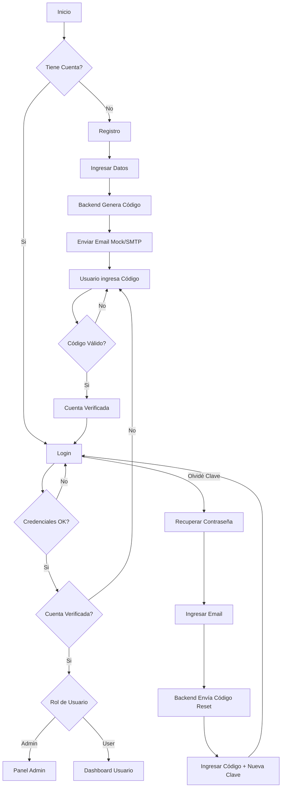

# Mi Super Landing Page 🚀

Sistema completo de autenticación y paneles de usuario con backend Node.js + Express y MySQL en AWS RDS.

## 🎯 Características

- ✅ **Backend Robusto**: API REST con Node.js y Express.
- ✅ **Base de Datos Cloud**: MySQL alojada en AWS RDS.
- ✅ **Roles de Usuario**:
  - **Admin**: Acceso a panel de administración exclusivo.
  - **User**: Acceso a dashboard personal.
- ✅ **Seguridad**:
  - Contraseñas hasheadas con SHA-256.
  - Protección contra inyección SQL.
- ✅ **Flujos de Autenticación**:
  - Registro con **verificación de email** (código de 6 dígitos).
  - Login con redirección inteligente basada en roles.
  - **Recuperación de contraseña** segura vía email.
- ✅ **Frontend Moderno**:
  - Diseño **Glassmorphism** premium.
  - Totalmente **Responsive** (Móvil y Escritorio).
  - Animaciones fluidas y efectos parallax.

## 🔄 Flujo de Funcionamiento



## 📁 Estructura del Proyecto

El proyecto sigue una arquitectura limpia y modular:

```
Mi super landing page/
├── public/                  # Frontend (Archivos estáticos)
│   ├── index.html           # Página de Login/Registro
│   ├── dashboard.html       # Panel para usuarios
│   ├── admin.html           # Panel para administradores
│   ├── reset-password.html  # Recuperación de contraseña
│   ├── style.css            # Estilos globales (Glassmorphism)
│   └── script.js            # Lógica del frontend
│
├── src/                     # Backend (Código fuente)
│   ├── config/              # Configuración (BD, etc.)
│   ├── routes/              # Definición de rutas API
│   ├── utils/               # Utilidades (Hash, Email Mock)
│   └── server.js            # Punto de entrada del servidor
│
├── scripts/                 # Scripts de mantenimiento
│   ├── create_admin.js      # Crear usuario administrador
│   ├── update_schema.js     # Actualizar BD (add verification)
│   └── add_reset_columns.js # Actualizar BD (add reset password)
│
└── docs/                    # Documentación adicional
```

## 🚀 Instalación y Uso

### 1. Instalar dependencias
```bash
npm install
```

### 2. Configurar entorno
Asegúrate de tener el archivo `.env` configurado con tus credenciales de base de datos AWS RDS y puerto (ej. 3000).

### 3. Scripts de Base de Datos (Opcional)
Si es la primera vez, asegúrate de que tu esquema de base de datos esté actualizado:
```bash
# Crea un usuario admin por defecto (admin@example.com / admin123)
npm run create-admin
```

### 4. Iniciar el servidor
```bash
npm start
```
*El servidor iniciará en http://localhost:3000*

## 🧪 Cómo Probar las Funcionalidades

### � Verificación de Email y Recuperación
El sistema utiliza un **Mock de Email** por defecto si no se configuran credenciales SMTP reales. Esto significa que los correos no se envían realmente, sino que **se imprimen en la consola del servidor**.

1. **Regístrate** en la web.
2. Mira la terminal donde corre el servidor (`npm start`).
3. Verás un mensaje como:
   ```text
   [EMAIL MOCK] -----------------------------
   To: nuevo@example.com
   Subject: Código de Verificación
   Verification Code: 123456
   ------------------------------------------
   ```
4. Usa ese código `123456` en el navegador para verificar la cuenta.

### 👤 Roles
- **Usuario Normal**: Regístrate desde la web. Accederás a `dashboard.html`.
- **Administrador**: Loguéate con `admin@example.com` (pass: `admin123`). Accederás a `admin.html`.

## 🔐 API Endpoints Clave

| Método | Endpoint | Descripción |
|--------|----------|-------------|
| POST | `/api/auth/register` | Registro (envía código) |
| POST | `/api/auth/verify` | Validar código de registro |
| POST | `/api/auth/login` | Iniciar sesión (chequea rol y estado) |
| POST | `/api/auth/forgot-password` | Solicitar código de recuperación |
| POST | `/api/auth/reset-password` | Cambiar contraseña con código |

---

**Desarrollado con ❤️ usando Node.js + Express + MySQL**
